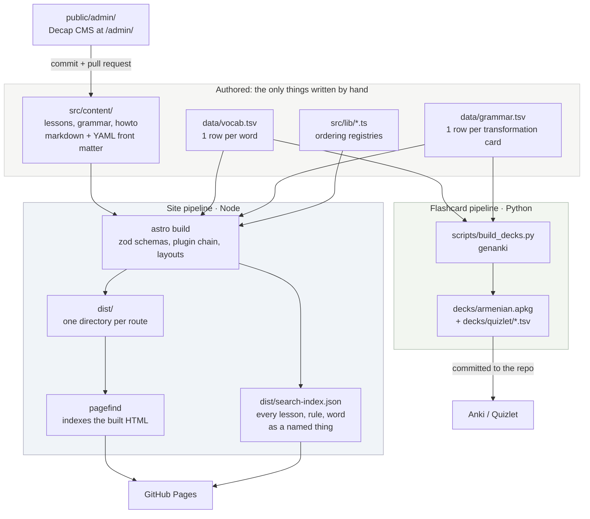
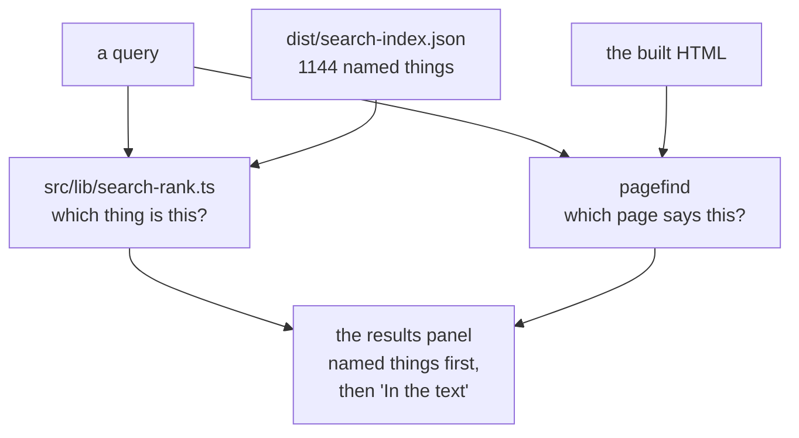
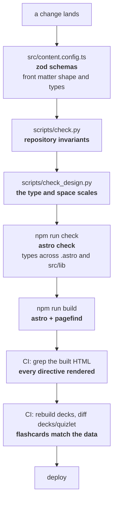

# Architecture

Two build pipelines over one set of sources. Nothing is generated at request time:
the site is static files on GitHub Pages, and the flashcards are committed output.

Keep this file current when you add a pipeline, a registry, or a check. The
[Extension points](#extension-points) table is the part that goes stale first.

## The whole system

`data/vocab.tsv` feeding both pipelines is the point: a glossary page on the site
and the flashcard for the same word are rendered from one row, so they cannot
disagree.

## How a page gets rendered

```mermaid
flowchart LR
    fm["*.md"] --> schema["src/content.config.ts<br/>zod: a malformed lesson<br/>fails the build"]
    schema --> rd["remark-directive<br/>parses the ::: directives"]
    rd --> rb["src/plugins/remark-blocks.mjs<br/>directives → aside/details/tabs"]
    rb --> rm["src/plugins/rehype-media.mjs<br/>img class + width/height from<br/>the PNG header"]
    rm --> rfold["src/plugins/rehype-fold.mjs<br/>folds a whole section<br/>behind its own heading"]
    rfold --> rbase["src/plugins/rehype-base.mjs<br/>prefixes root-relative links<br/>with the base path"]
    rbase --> page["src/pages<br/>index and slug routes"]
    page --> doc["src/layouts/Doc.astro<br/>title, rails, pager"]
    doc --> base["src/layouts/Base.astro<br/>head, Header, Search, client scripts"]
    base --> html["static HTML"]
```

Order matters in two places. `remark-directive` has to run before
`remark-blocks`, because one parses the syntax and the other rewrites it. And
`rehype-base` runs last, so it sees every `href` the earlier plugins produced.

`rehype-fold` reads a `FOLD` set of heading names, `exercises` today. The
markdown says nothing about it: a lesson writes `## Exercises` and gets a
section that opens on demand, with the heading still carrying its own id, so
the contents keeps working (`Base.astro` opens a fold that a link points into).

**Editing a plugin?** Delete `node_modules/.astro` first. Astro caches rendered
markdown between builds and does not invalidate it when a plugin changes.

## src/lib: the registries

Each module is the single place that answers one question. Only `vocab.ts`
touches the filesystem; the rest are plain data plus a helper.

| Module | Answers | Consumers |
|---|---|---|
| `site.ts` | What is the base path? What is the site called? | every page and component |
| `grammar.ts` | `GROUPS`: which group a topic is in, and the reference order that drives the index and the pager | `/grammar/` index, `/grammar/[slug]` |
| `howto.ts` | `HOWTO_ORDER`: the running order, by when you need a script | `/how-to/` index, `/how-to/[slug]` |
| `vocab.ts` | The words themselves, plus `TOPICS` and `NON_TOPIC_TAGS` | `/vocabulary/*`, `WordTable`, home page |
| `hy.ts` | The language rules: `SUFFIXES` + `stem()`, `ALPHABET`, `initialLetter()`, `byArmenian` | `vocab.ts`, `search-rank.ts`, word filter |
| `search.ts` | Every lesson, rule, how-to, topic and word as a named thing | `pages/search-index.json.ts` |
| `search-rank.ts` | Which of those things a query names, in order | `Search.astro` |

A page missing from its registry does not error. It quietly stops appearing in
its own index. `scripts/check.py` is what makes that impossible; see below.

`hy.ts` exists because of the build/runtime line. `vocab.ts` reads `data/*.tsv`
through `node:fs`, so nothing the browser bundles can import it, and the same
four rules are needed on both sides:

- `SUFFIXES` and `stem()` fill `data-stem` on every row at build time, and stem
  the query in the word filter and in search. One list, so a search and the rows
  it searches cannot drift.
- `byArmenian` is the collation the whole site sorts by. `Array.sort` would put
  every capitalised proper noun first.
- `ALPHABET` and `initialLetter()` decide what a letter is, for the cloud on the
  home page and for the dividers in the word table, which therefore agree.

## Search

Two layers, because two different questions get typed into one field.

Full text alone was answering the wrong question. "L2" returned thirty-six pages
and not lesson 2; "Lesson 2" put the thousand-word glossary first, because that
page holds the word "lesson" and a great many 2s and BM25 cannot tell which of
them is a name. So `src/lib/search.ts` lists the things themselves (every
lesson, grammar page, how-to, topic and word, with its title, its one-line
summary and its number) and `search-rank.ts` scores a query against that list by
how well it *names* an entry: exact title, then title prefix, then a word inside
it, then a mention. Lesson numbers are parsed rather than matched, so `L2`,
`l02`, `lesson 2` and `урок 2` all mean one page.

Two things follow for the pages themselves. The pager carries
`data-pagefind-ignore`, or every lesson would contain the titles of its two
neighbours; and so does `WordTable`, because a thousand words on one page made
the glossary the best full-text answer to nearly everything. Words are still
searchable, as entries of their own, with their gloss and their lesson.

## Where each invariant is enforced

`scripts/check.py` owns the invariants no other stage can see:

1. Lesson front matter matches the file name; the date parses; every `grammar:`
   slug names a page that exists.
2. Lesson numbering is continuous and dates rise with the number.
3. Every lesson with words has a page, and every lesson page has words.
4. Directive fences nest: an outer block carries more colons than anything
   inside it, or remark closes it at the first inner `:::`.
5. Grammar pages never link back to a lesson, and each opens with `> **One line.**`.
6. `data/grammar.tsv` points only at grammar pages that exist.
7. The three registries cover everything they are responsible for: every grammar
   page is in `GROUPS`, every how-to is in `HOWTO_ORDER`, and every tag in
   `data/vocab.tsv` is declared in either `TOPICS` or `NON_TOPIC_TAGS`.

`scripts/check_design.py` owns one invariant of its own: every font size, line
height, margin, padding and gap in the stylesheets comes from a token in
`:root`. Exceptions live in its `ALLOWED` set, each with the reason it is there.

Because check.py parses the TypeScript registries by pattern, it fails loudly if
it cannot find or parse one. A check that silently matches nothing is worse than
no check.

## Extension points

| To add… | Touch | Then |
|---|---|---|
| a lesson | `src/content/lessons/lNN.md`, rows in `data/vocab.tsv` | `python3 scripts/build_decks.py` and commit `decks/` |
| a grammar topic | `src/content/grammar/<slug>.md` **and** a `slugs:` entry in `src/lib/grammar.ts` | open with `> **One line.**`; never link to a lesson |
| a how-to script | `src/content/howto/<slug>.md` **and** an entry in `HOWTO_ORDER` | nothing else |
| a vocabulary topic | a `TOPICS` row in `src/lib/vocab.ts`, and the tag on the words | the page at `/vocabulary/<tag>/` generates itself |
| a tag with no page of its own | `NON_TOPIC_TAGS` in `src/lib/vocab.ts` | it still reaches the Anki notes |
| a search intent (a new way to name a thing) | `LESSON_Q` or the field weights in `src/lib/search-rank.ts` | new pages and words need nothing: `search.ts` walks the collections |
| a section that folds away | its heading name in `FOLD`, `src/plugins/rehype-fold.mjs` | every lesson with that heading folds it; the markdown does not change |
| a block type | `BLOCKS` in `src/plugins/remark-blocks.mjs`, styles in `global.css`, and the allowed set in `scripts/check.py` | the CI markup grep catches a directive that renders unhandled |

`scripts/check.py` fails on any of these done by halves, which is the point:
adding a page and forgetting its registry entry is the one mistake that
otherwise produces a working build and a missing page.

## Client-side JavaScript

There is no framework and nothing hydrates. Five pieces, all progressive:

| Where | What | Without JS |
|---|---|---|
| `Base.astro` head, inline | reads the stored theme before first paint | light theme |
| `Base.astro`, bundled | theme toggle, tab sets, table wrapping, contents highlight, opening a fold a link points into | tabs render as one stacked paradigm; a folded section opens by hand |
| `Search.astro`, bundled | ranks `search-index.json`, then Pagefind underneath; both fetched on first open only | the button does nothing |
| `pages/index.astro` | the alphabet word cloud | the alphabet is inert text |
| `pages/vocabulary/index.astro` | filter, stem matching, `?q=` deep links | the full table is there |

The two `define:vars` scripts (the cloud and the word filter) are `is:inline`
because that is what `define:vars` implies: Astro cannot process a script whose
source it has to interpolate into. `Search.astro` is bundled instead, which is
why its ranking can live in `src/lib` and be imported.

## Styling

`src/styles/global.css` is the whole design system and the only file in the
repository holding a hex value. **[GUIDELINES.md](GUIDELINES.md) is the rules it
follows**: the type and space scales, the measure, the target sizes, the colour
and contrast rules, and the exceptions with their reasons. `scripts/check_design.py`
fails the build on a size or a space that is not on a scale. Its header states the four rules; the tokens at
the top are the only place a colour is defined. Components carry a scoped
`<style>` block only for markup that exists nowhere else: `WordTable`, and the
filter on the words index.

Glass is one material with three tints: `--glass-blur` and `--glass-saturate`
are shared by the header band, the sheet the alphabet raises and the search
panel, which differ only in how much paper is mixed into them. The header is the
one graduated surface: three stacked panes, each masked, so its blur tapers out
over the last few pixels instead of stopping at a line. Spread wider, the taper
made the same header look like fog on one page and like nothing on the next.

Stylesheets are inlined into each page (`inlineStylesheets: "always"` in
`astro.config.mjs`) because GitHub Pages caches HTML for a few minutes: a cached
page pointing at a replaced hashed stylesheet renders unstyled.
