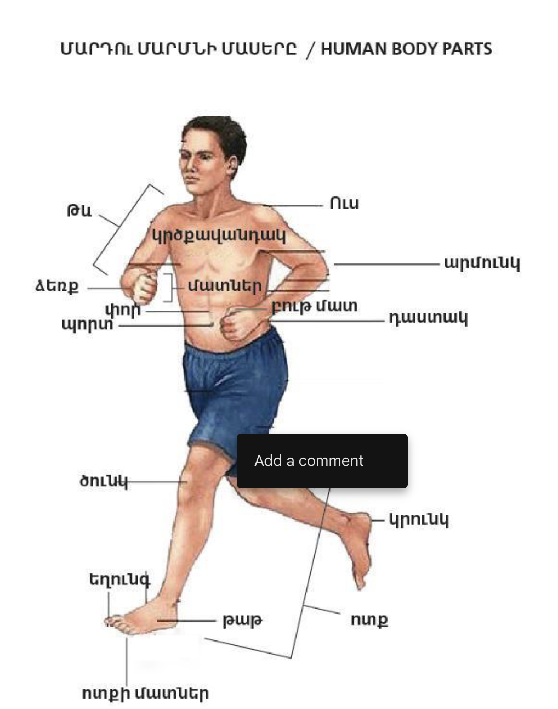

# Lesson 29

*25 May 2026 · tutor's lesson 33*

**Topics:** կ- future in sentences · conditions with եթե · parts of the body · the fingers

## New words

!!! vocab "New words — class"

    | Armenian | English | Phrase |
    |---|---|---|
    | ամպամած | cloudy |  |
    | համալսարան | university | Վաղը մենք կգնանք համալսարան — Tomorrow we will go to university |
    | կոնյակ | cognac |  |
    | պիցա | pizza |  |

## Grammar

!!! rule "կ- future in sentences"

    **The կ- future is used for plain "will"; after եթե (if) the condition takes the bare subjunctive and the main clause the կ- future.**

    :   Վաղը մենք կգնանք համալսարան։ — Tomorrow we will go to university.
    :   Եթե ես առողջանամ, վաղը համալսարան կգամ։ — If I get well, tomorrow I will go to university.

    Full reference → [Future with կ- (will)](../grammar/future-k.md)

## Examples

- **Վաղը մենք կգնանք համալսարան։** — Tomorrow we will go to university.
- **Դուք կգնաք համալսարան, թե՞ գրադարան։** — Will you go to university or to the library?
- **Նրա ընկերները չեն խմի մեզ հետ։** — His / her friends will not drink with us.
- **Քո ծնողները կմնան այսօր տանը, իսկ վաղը կգնան Փարիզ։** — Your parents will stay at home today, but tomorrow they will go to Paris.
- **Այդ գիրքը կտամ քեզ վաղը, իսկ այսօր կմնամ տանը և կկարդամ։** — I'll give you that book tomorrow, but today I'll stay at home and read.
- **Եթե ուզում ես, քո ընկերները կգան քո տուն և դուք կխմեք կոնյակ և կուտեք պիցա։** — If you want, your friends will come to your house and you will drink cognac and eat pizza.
- **Եթե ես առողջանամ, վաղը համալսարան կգամ։** — If I get well, tomorrow I will go to university.

## Parts of the body

!!! vocab "Parts of the body"

    | Armenian | English | Phrase |
    |---|---|---|
    | թև | arm |  |
    | ուս | shoulder |  |
    | կրծքավանդակ | chest |  |
    | արմունկ | elbow |  |
    | ձեռք | hand, arm |  |
    | մատ | finger *(pl. մատներ)* |  |
    | դաստակ | wrist |  |
    | փոր | belly |  |
    | պորտ | navel |  |
    | ծունկ | knee |  |
    | կրունկ | heel |  |
    | եղունգ | nail |  |
    | թաթ | foot (sole), paw |  |
    | ոտք | leg, foot |  |
    | ոտքի մատ | toe *(pl. ոտքի մատներ)* |  |

!!! vocab "The fingers"

    | Armenian | English | Phrase |
    |---|---|---|
    | բութ մատ | thumb |  |
    | ցուցամատ | index finger |  |
    | միջնամատ | middle finger |  |
    | մատանեմատ | ring finger |  |
    | ճկույթ | little finger |  |

## Homework

Learn the colours. Check the homework — we did not get to it in class.

## Flashcards

Anki `hy::vocab::L29` · Quizlet: not created yet
